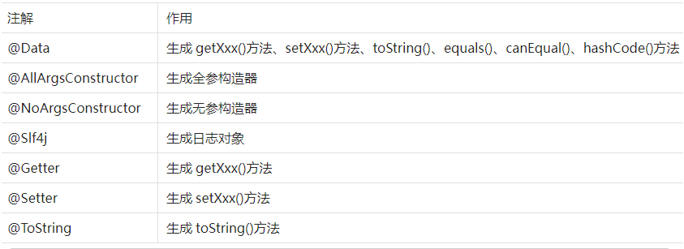
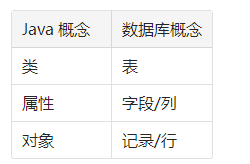

Mybatis

使用日志

log4j2的使用

Lombok插件

Lombok注解

mybatis 基本操作01

1.物理建模

2.逻辑建模

3.搭建框架开发环境

1. 导入依赖

2. 准备配置文件 
   
    ①mybatis全局核心配置文件mybatis-config.xml
    
    ②mybatis映射配置文件

    ORM(Object Relationship Mapping) 对象关系映射
    
    Object:Java实体类对象

    Relationship:关系型数据库

    Mapping:二者之间的对应关系
    
    
    

4.Junit测试

