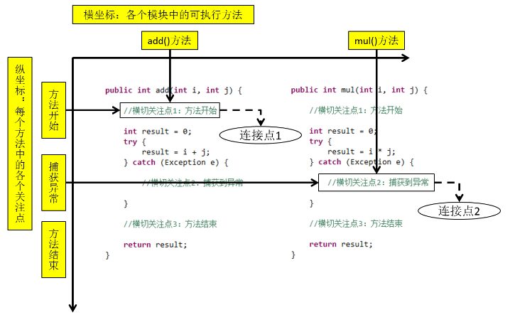

###### **AOP**

1. AOP : Aspect Oriented Programming ,面向切面

2. AOP的作用
    
    1) 代码简化：
       
        把方法中固定位置的重复的代码抽取出来，让被抽取的方法更专注于自己的核心功能，提高内聚性。
    2) 代码增强：
        
        把特定的功能封装到切面类中，看哪里有需要，就往上套，被套用了切面逻辑的方法就被切面给增强了。
    

3. 横切点关注
   从每个方法中抽取出来的同一类非核心业务。
   在同一个项目中，我们可以使用多个横切关注点对相关方法进行多个不同方面的增强。
   

4. 通知

    每一个横切关注点上要做的事情都需要写一个方法来实现，这样的方法就叫通知方法。
    1) 前置通知：在被代理的目标方法前执行;
    2) 返回通知：在被代理的目标方法成功结束后执行;
    3) 异常通知：在被代理的目标方法异常结束后执行;
    4) 后置通知：在被代理的目标方法最终结束后执行;
    5) 环绕通知：使用try...catch...finally结构围绕整个被代理的目标方法，包括上面四种通知对应的所有位置.
    

5. 切面

   封装通知方法的类。根据不同的非核心业务逻辑，我们可以创建不同的切面类：
    1) 日志功能：日志切面
    2) 缓存功能：缓存切面
    3) 事务功能：事务切面
    

6. 目标 ：被代理的对象

7. 代理

    向目标对象应用通知之后创建的代理对象。
   
   就动态代理技术而言，JDK会在运行过程中根据我们提供的接口动态生成接口的实现类。 
   
   那么我们这里谈到的代理对象就是这个动态生成的类的对象。

8. 连接点
   
   把方法排成一排，每一个横切位置看成x轴方向，把方法从上到下执行的顺序看成y轴，x轴和y轴的交叉点就是连接点。

    
   

9. 切入点 : 定位连接点的方式

   通过切入点，可以将通知方法精准地植入到被代理目标方法的指定位置。

   如果把连接点看作数据库中的记录，那么切入点就是查询记录的 SQL 语句。

   Spring 的 AOP 技术可以通过切入点定位到特定的连接点。

   切点通过 org.springframework.aop.Pointcut 接口进行描述，它使用类和方法作为连接点的查询条件。

