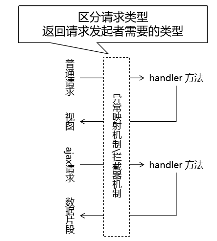

                **Spring practice project**

this module is about some simple practice of spring .

###### **异常映射**
将异常类型和某个具体的视图关联起来，建立映射关系。好处是可以通过 SpringMVC 框架来帮助我们管理异常。
1. 使用声明式代替编程式来实现异常管理
   
    - 让异常控制和核心业务解耦，二者各自维护，结构性更好
   
2. 使用声明式代替编程式来实现异常管理

   - 整个项目代码风格更加统一、简洁

   - 便于团队成员之间的彼此协作
   
异常处理器类需要使用 @ControllerAdvice 注解标记

区分请求类型

异常处理机制和拦截器机制都面临这样的问题：

查看请求消息头中是否包含 Ajax 请求独有的特征：

   - Accept 请求消息头：包含 application/json
   
   - X-Requested-With 请求消息头：包含 XMLHttpRequest

两个条件满足一个即可。